# 📦 Warehouse & Inventory Management System

A full-stack **Warehouse & Inventory Management System** designed to manage masters, orders, dispatch, warehouse inward, stock transfers, labour issue management, and inventory tracking — with a modular architecture and role-based permissions.

> Built using **React**, **Redux**, **Node.js**, **Express**, **MongoDB**, and **Bootstrap**, providing a structured and scalable solution for warehouse operations.

---

## 📑 Table of Contents

- [Project Overview](#-project-overview)
- [System Architecture](#-system-architecture)
- [Main Modules](#-main-modules)
- [Masters Module](#-masters-module)
- [Users & Permissions](#-users--permissions-module)
- [Orders Module](#-orders-module)
- [Dispatch Module](#-dispatch-module)
- [Warehouse Inward Module](#-warehouse-inward-module)
- [Issue To Labour Module](#-issue-to-labour-module)
- [Stock Transfer Module](#-stock-transfer-module)
- [Inventory Module](#-inventory-module)
- [Dashboard Module](#-dashboard-module)
- [Complete Workflow](#-complete-project-workflow)
- [Module-Wise Flow](#-module-wise-working-flow)
- [Frontend Architecture](#-frontend-architecture)
- [Backend Architecture](#-backend-architecture)
- [Database Schema](#-database--collection-schema)
- [Tech Stack](#-tech-stack)
- [Authentication](#-authentication)
- [Installation](#-installation)
- [Future Improvements](#-future-improvements)

---

## 🧾 Project Overview

This project manages the **complete lifecycle of warehouse operations**, including:

| Area | Description |
|------|-------------|
| 📋 Item Masters | Base data management for items, categories, units, GST |
| 🛒 Orders | Customer order creation and approval |
| 🚚 Dispatch | Sending items from warehouse to customers |
| 📥 Warehouse Inward | Recording stock received into warehouse |
| 👷 Labour Issues | Tracking items issued to workers |
| 🔄 Stock Transfers | Moving stock between warehouses |
| 📊 Inventory | Real-time availability tracking |
| 🔐 Permissions | Role-based access per module and action |

The system ensures that inventory movement is tracked across **all modules**, preventing stock inconsistencies.

---

## 🏗 System Architecture

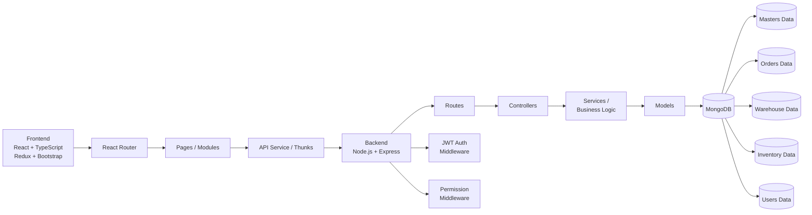

**How it fits together:**
- **Frontend** handles UI, routing, tables, forms, and state management via Redux Toolkit
- **Backend** is organized into routes → controllers → business logic → models
- **MongoDB** stores all operational data
- **JWT + Permission middleware** secures access to every module and action

---

## 🧩 Main Modules

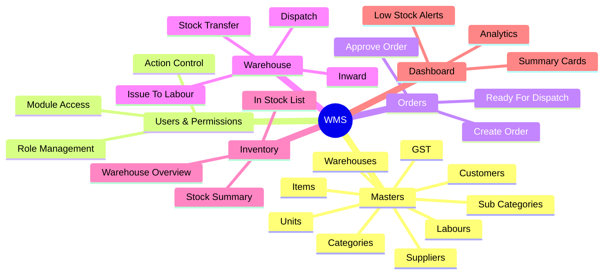

---

## 🧱 Masters Module

Masters store the **base reference data** used across the entire system. All transaction modules depend on masters being set up first.

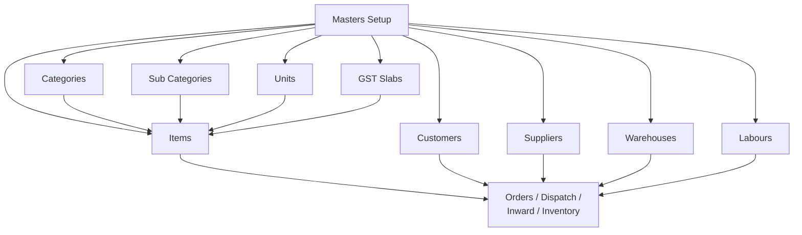

### Sub-modules

| Sub Module | Purpose | Example |
|------------|---------|---------|
| **Categories** | Main item classification | Electronics, Hardware, Tools |
| **Sub Categories** | Child classification | Electronics → Mobile, Laptop |
| **Units** | Measurement units | Nos, Kg, Meters, Boxes |
| **GST** | Tax slabs | 5%, 12%, 18%, 28% |
| **Items** | Core inventory items | Name, Code, Category, Unit, GST |
| **Customers** | Customer details | Name, Phone, Address, City |
| **Suppliers** | Supplier information | Name, Contact, Address |
| **Warehouses** | Storage locations | Main, Factory, Retail |
| **Labours** | Worker details | Name, Assignment info |

---

## 👤 Users & Permissions Module

The system includes **role-based access control** with granular per-module permissions.

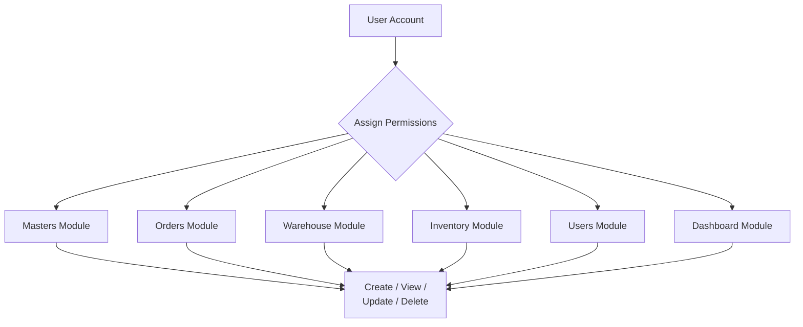

**Permission types:** `Create` · `View` · `Update` · `Delete`

Each user is assigned permissions **per module per action**, enabling fine-grained enterprise-level access control.

---

## 🧾 Orders Module

Handles customer order creation and status tracking.

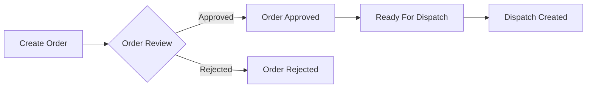

**Order includes:** Customer · Items · Quantity · Price · GST · Total Amount · Status History

---

## 🚚 Dispatch Module

Dispatch sends items **from warehouse to customers** or routes them internally.

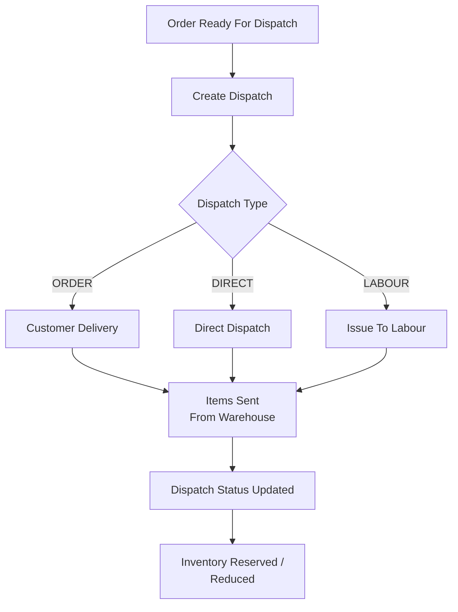

**Dispatch contains:** Dispatch No · Order Reference · Customer · Warehouse · Items · Date · Transport Details

---

## 📥 Warehouse Inward Module

Warehouse inward records **stock received** into a warehouse, increasing inventory.

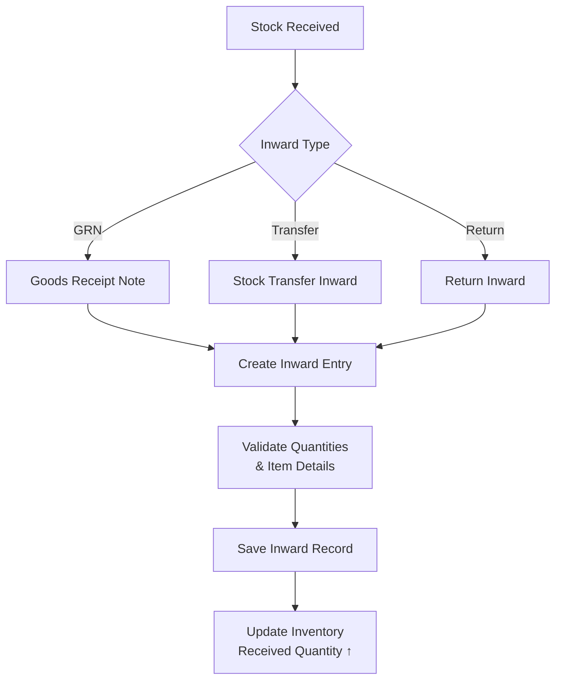

---

## 👷 Issue To Labour Module

Tracks items **issued to workers** for use on jobs.

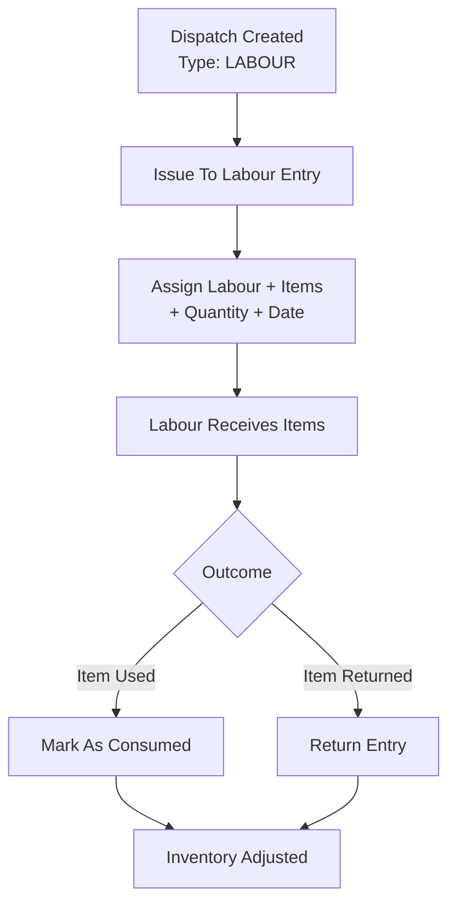

**Issue record includes:** Labour Name · Item · Quantity · Issue Date · Return Status

---

## 🔄 Stock Transfer Module

Transfers stock **between warehouses**, maintaining per-warehouse inventory accuracy.

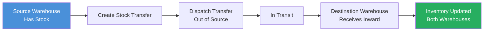

**Transfer flow:** Source stock is moved out → destination receives inward → both warehouse inventories update accordingly.

---

## 📊 Inventory Module

Inventory tracks **real-time item quantities** per warehouse using a simple, reliable formula.

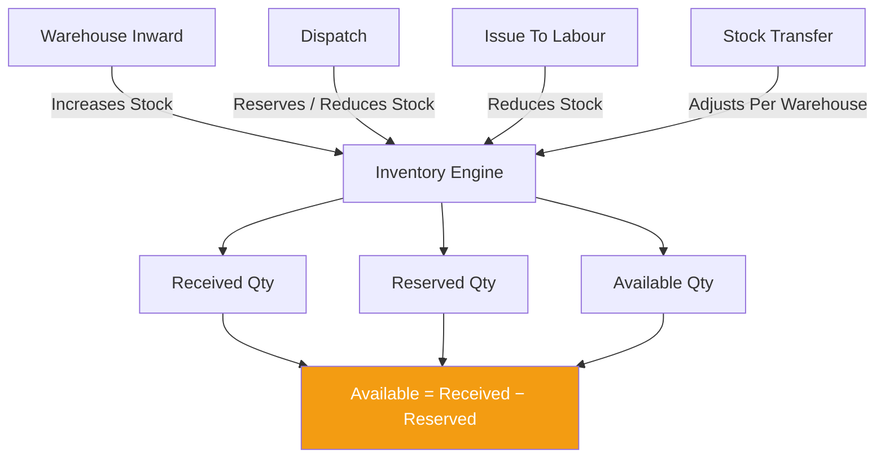

| Quantity Type | Meaning |
|---------------|---------|
| **Received Quantity** | Total stock received via inward |
| **Reserved Quantity** | Stock reserved by dispatches / issues |
| **Available Quantity** | `Received − Reserved` — what can be used |

---

## 📊 Dashboard Module

Provides **summary analytics** across all modules at a glance.

| Widget | Description |
|--------|-------------|
| 📦 Total Orders | Count of all orders |
| 🚚 Total Dispatches | Count of all dispatches |
| 📊 Inventory Overview | Stock levels by warehouse |
| ⏳ Pending Dispatches | Orders awaiting dispatch |
| 📥 Pending Inwards | Stock awaiting inward entry |
| ⚠️ Low Stock Items | Items below threshold |

---

## 🔄 Complete Project Workflow

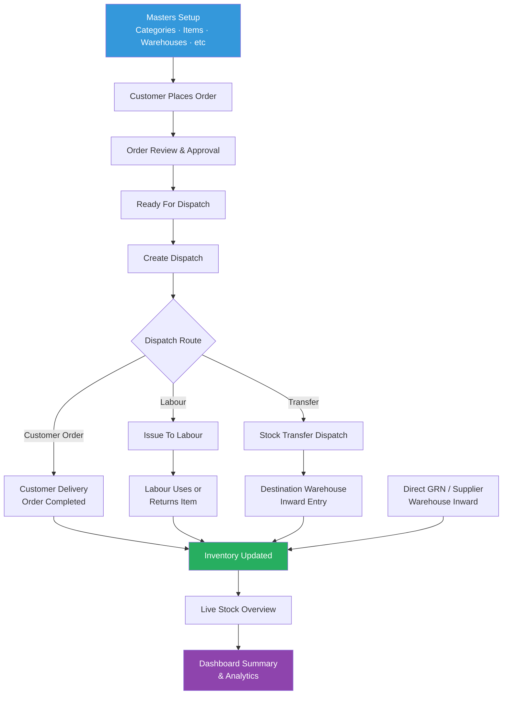

---

## 🔁 Module-Wise Working Flow

### 1. Masters → Transactions Flow

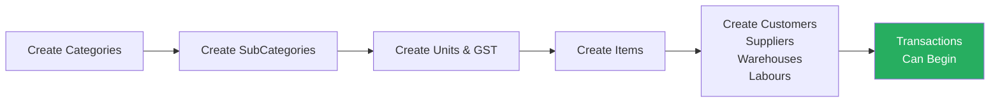

### 2. Order → Dispatch Flow

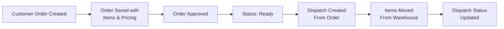

### 3. Dispatch → Labour Flow

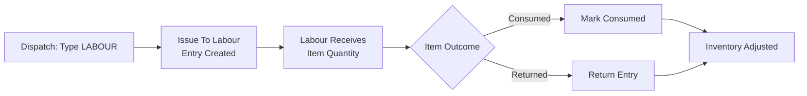

### 4. Stock Transfer Flow

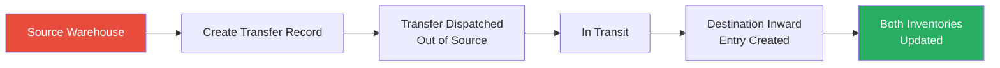

### 5. Warehouse Inward Flow

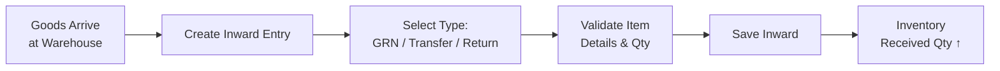

### 6. Inventory Update Flow

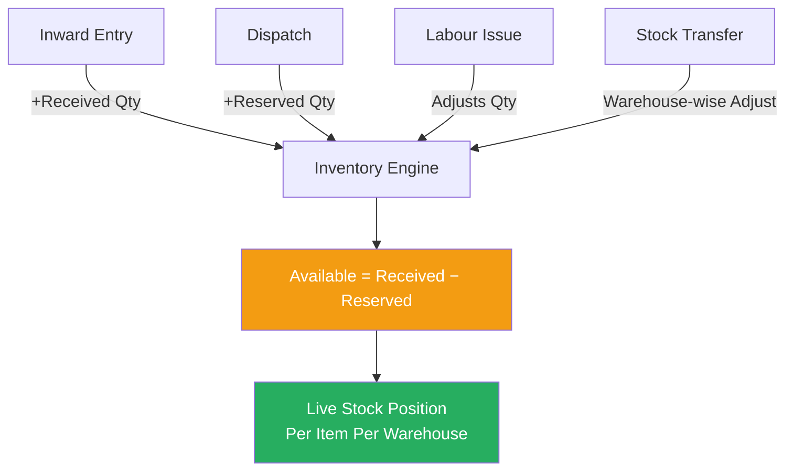

---

## 🖥 Frontend Architecture

```
src/
 ├── components/
 │    ├── Table/
 │    ├── Forms/
 │    └── Layout/
 ├── pages/
 │    ├── Authentication/
 │    ├── Dashboard/
 │    ├── Masters/
 │    ├── Orders/
 │    ├── Warehouse/
 │    └── Inventory/
 ├── slices/
 │    ├── auth/
 │    ├── orders/
 │    ├── inventory/
 │    └── warehouse/
 ├── routes/
 ├── utils/
 └── types/
```

---

## ⚙ Backend Architecture

```
backend/
 ├── controllers/
 ├── models/
 ├── routes/
 ├── services/
 ├── middlewares/
 ├── utils/
 └── config/
```

---

## 🗂 Database / Collection Schema

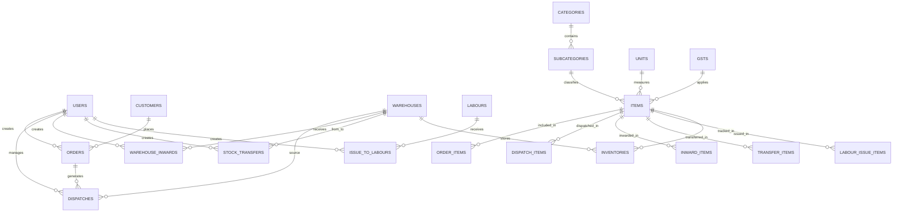

---

## 🔧 Tech Stack

### Frontend

| Technology | Purpose |
|------------|---------|
| React | UI Framework |
| Redux Toolkit | State Management & Async Thunks |
| TypeScript | Type Safety |
| Bootstrap | Styling & Layout |
| TanStack Table | Advanced Data Tables |
| Formik + Yup | Forms & Validation |
| React Router | Client-Side Routing |

### Backend

| Technology | Purpose |
|------------|---------|
| Node.js | Runtime |
| Express.js | Web Framework |
| MongoDB | Database |
| Mongoose | ODM / Schema Management |
| JWT | Authentication |

### Tools

Git · GitHub · Postman · VS Code

---

## 🔐 Authentication

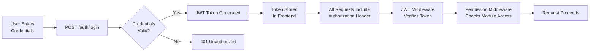

---

## 📸 Screenshots

| Module | Screenshot |
|--------|-----------|
| Dashboard |  |
| Orders |  |
| Dispatch |  |
| Warehouse Inward |  |
| Stock Transfer |  |
| Issue To Labour |  |
| Inventory |  |

---

## 🚀 Installation

### 1. Clone Repository

```bash
git clone https://github.com/yourusername/warehouse-management-system.git
cd warehouse-management-system
```

### 2. Backend Setup

```bash
cd backend
npm install
npm run dev
```

### 3. Frontend Setup

```bash
cd frontend
npm install
npm run dev
```

---

## 🌱 Future Improvements

- [ ] Barcode scanning integration
- [ ] PDF invoice generation
- [ ] Advanced analytics dashboard
- [ ] Email notifications
- [ ] Mobile responsive UI
- [ ] Multi-warehouse analytics

---

## 🌟 Why This Project Stands Out

This is not just a CRUD application. It demonstrates:

- ✅ **Modular full-stack architecture** — clean separation of concerns across all layers
- ✅ **Real business process handling** — mirrors actual warehouse operations
- ✅ **Interconnected module dependencies** — modules work together, not in isolation
- ✅ **Role-based permissions** — enterprise-grade access control
- ✅ **Reusable components** — shared table and form structures throughout
- ✅ **Live inventory calculations** — accurate, formula-driven stock tracking
- ✅ **Scalable design** — built to extend into ERP-level systems

**Ideal portfolio project for:** Full Stack Developer · MERN Stack Developer · ERP/Inventory Software · Warehouse & Operations Tech

---

<p align="center">Built with ❤️ using the MERN Stack</p>
