# 📦 Warehouse & Inventory Management System

A full-stack **Warehouse & Inventory Management System** designed to manage masters, orders, dispatch, warehouse inward, stock transfers, labour issue management, and inventory tracking — with a modular architecture and role-based permissions.

> Built using **React**, **Redux**, **Node.js**, **Express**, **MongoDB**, and **Bootstrap**, providing a structured and scalable solution for warehouse operations.

---

## 📑 Table of Contents

- [Project Overview](#-project-overview)
- [System Architecture](#-system-architecture)
- [Main Modules](#-main-modules)
- [Masters Module](#-masters-module)
- [Users & Permissions](#-users--permissions-module)
- [Orders Module](#-orders-module)
- [Dispatch Module](#-dispatch-module)
- [Warehouse Inward Module](#-warehouse-inward-module)
- [Issue To Labour Module](#-issue-to-labour-module)
- [Stock Transfer Module](#-stock-transfer-module)
- [Inventory Module](#-inventory-module)
- [Dashboard Module](#-dashboard-module)
- [Complete Project Workflow](#-complete-project-workflow)
- [Module-Wise Working Flow](#-module-wise-working-flow)
- [Module Submodule Structure](#-module--submodule--sub-submodule-structure)
- [Frontend Architecture](#-frontend-architecture)
- [Backend Architecture](#-backend-architecture)
- [Database Schema](#-database--collection-schema-overview)
- [Tech Stack](#-tech-stack)
- [Authentication](#-authentication)
- [Installation](#-installation)
- [Future Improvements](#-future-improvements)
- [Why This Project Is Strong](#-why-this-project-is-strong)

---

## 🧾 Project Overview

This project manages the **complete lifecycle of warehouse operations**, including:

- **Item master management** — base data for items, categories, units, and GST
- **Order creation** — customer orders with items, quantities, and pricing
- **Dispatch management** — sending items from warehouse to customers
- **Warehouse inward operations** — receiving and recording incoming stock
- **Labour issue tracking** — items issued to workers with return/consume tracking
- **Stock transfers** — moving inventory between multiple warehouses
- **Inventory availability** — real-time received, reserved, and available quantities
- **Role-based permissions** — module and action-level access control
- **Structured module architecture** — scalable, maintainable enterprise-style design

The system ensures that **inventory movement is tracked across all modules**, preventing stock inconsistencies.

---

## 🏗 System Architecture

The project follows a **modular full-stack architecture**:

- **Frontend** handles UI, routing, tables, forms, and state management
- **Redux Toolkit** manages async API calls and global state
- **Backend** is organized into routes → controllers → business logic → models
- **MongoDB** stores all operational data
- **JWT + Permission middleware** secures access to every module and action

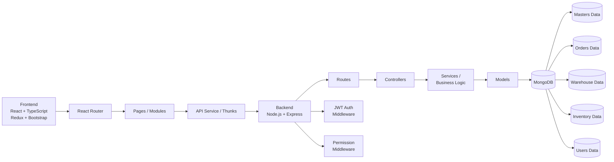

This structure makes the project **scalable**, **maintainable**, **easy to extend**, and suitable for role-based enterprise workflows.

---

## 🧩 Main Modules

The project is divided into the following major modules:

| Module | Responsibility |
|--------|---------------|
| **Masters** | Base reference data used across the entire system |
| **Users & Permissions** | Role-based access control per module and action |
| **Orders** | Customer order creation and approval workflow |
| **Warehouse** | Dispatch, inward, stock transfer, and labour operations |
| **Inventory** | Real-time item quantity tracking per warehouse |
| **Dashboard** | Summary analytics and key operational metrics |
| **Authentication** | JWT-based login and protected route management |

---

## 🧱 Masters Module

Masters store the **base reference data** used across the system. All transaction modules depend on masters being configured first.

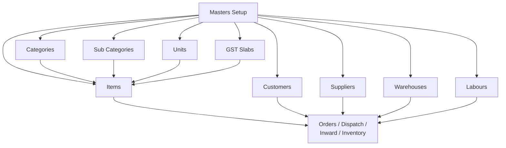

> **Without masters, transaction modules cannot function properly.** Masters are always the starting point.

### Sub Modules

**Categories** — Organizes items into main classifications.
> Examples: Electronics, Hardware, Tools

**Sub Categories** — Further classification of items under a parent category.
```
Electronics
   ├── Mobile
   ├── Laptop
   └── Accessories
```

**Units** — Defines measurement units used for items.
> Examples: Nos, Kg, Meters, Boxes

**GST** — Stores applicable GST percentage slabs.
> Examples: 5%, 12%, 18%, 28%

**Items** — Stores core inventory item information:

| Field | Description |
|-------|-------------|
| Item Name | Display name of the item |
| Item Code | Unique identifier code |
| Category | Linked main category |
| Sub Category | Linked sub-classification |
| Unit | Measurement unit |
| GST | Applicable tax slab |

**Customers** — Stores customer details: Customer Name, Contact Person, Phone, Address, City, State, Pincode.

**Suppliers** — Stores supplier information for procurement and inward processes.

**Warehouses** — Stores warehouse locations.
> Examples: Main Warehouse, Factory Warehouse, Retail Warehouse

**Labours** — Stores labour/worker details for job assignments and issue tracking.

---

## 👤 Users & Permissions Module

The system includes **role-based access control**. Each user gets permissions assigned per module and per action type.

**Permissions include:** `Create` · `View` · `Update` · `Delete`

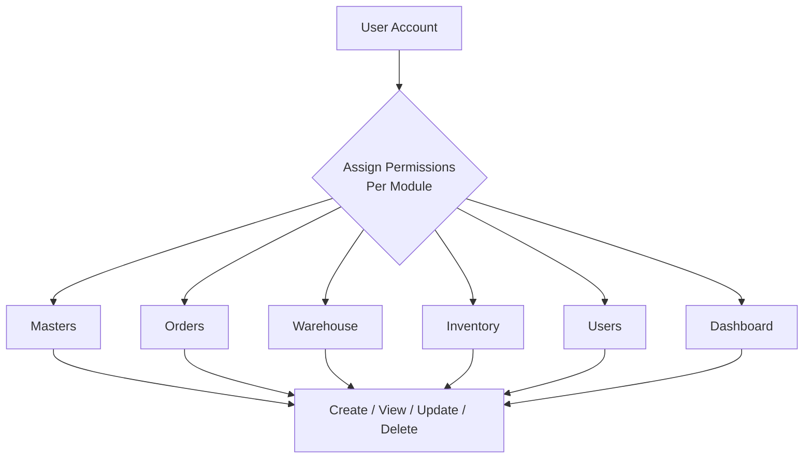

Each user gets permissions **per module per action**, enabling fine-grained enterprise-level access control.

---

## 🧾 Orders Module

Handles **customer order creation** and tracks the order through its lifecycle until it is ready for dispatch.

**Orders include:** Customer · Items · Quantity · Price · GST · Total Amount · Status History

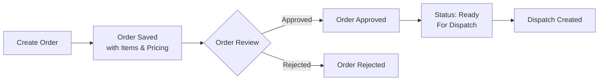

---

## 🚚 Dispatch Module

Dispatch **sends items from the warehouse** to customers or routes them internally to labour or other warehouses.

**Dispatch Types:**

| Type | Description |
|------|-------------|
| `ORDER` | Dispatch against a customer order |
| `DIRECT` | Direct dispatch without a linked order |
| `LABOUR` | Items dispatched for worker/labour use |

**Dispatch contains:** Dispatch Number · Order Reference · Customer · Warehouse · Items · Dispatch Date · Transport Details · Status

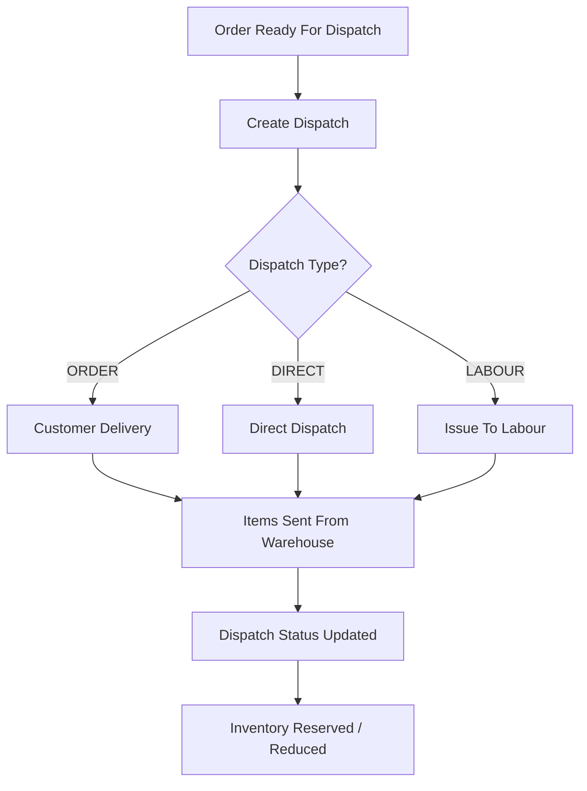

---

## 📥 Warehouse Inward Module

Warehouse inward **records stock received into a warehouse**, increasing the inventory quantities.

**Inward Types:**

| Type | Description |
|------|-------------|
| `GRN` | Goods Receipt Note — stock received from supplier |
| `Stock Transfer Inward` | Stock received from another warehouse |
| `Return Inward` | Stock returned by customer or labour |

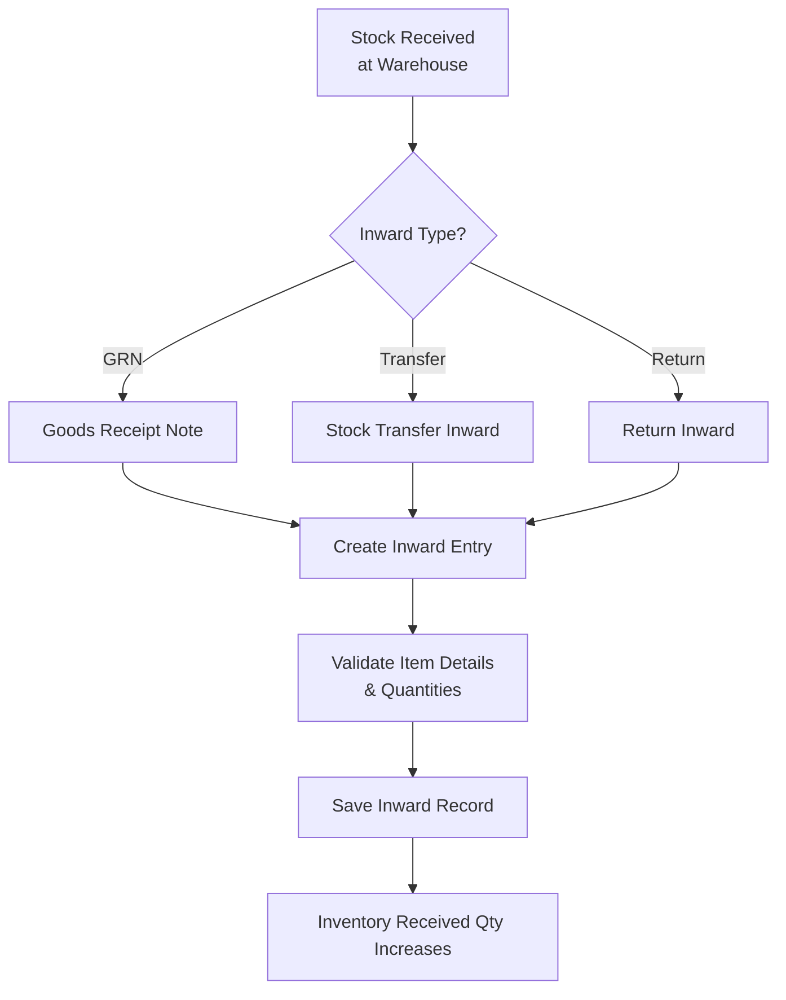

---

## 👷 Issue To Labour Module

Tracks **items issued to workers** for field use. Items may be consumed on the job or returned afterward.

**Issue record contains:** Labour Name · Linked Dispatch/Reference · Warehouse · Item List · Issued Quantity · Consumed/Return Status

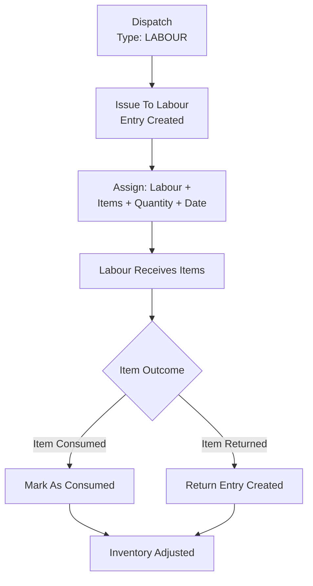

**This module is important** for tracing non-customer stock movement and ensuring all material issued to workers is accounted for.

---

## 🔄 Stock Transfer Module

Transfers stock **from one warehouse to another**, keeping per-warehouse inventory accurate throughout the movement.

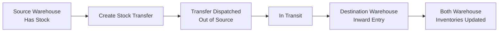

**How it works:**

1. A stock transfer is created from the source warehouse
2. The transfer is dispatched — source warehouse stock moves out
3. The destination warehouse creates an inward entry upon receipt
4. Both warehouse inventories are updated, keeping records warehouse-specific

---

## 📊 Inventory Module

Inventory tracks **real-time item quantities per warehouse**. It updates automatically whenever dispatch, inward, labour issues, or stock transfers occur.

**Inventory maintains:**

| Field | Description |
|-------|-------------|
| **Received Quantity** | Total stock received via inward entries |
| **Reserved Quantity** | Stock reserved by active dispatches / issues |
| **Available Quantity** | `Received − Reserved` — what can actually be used |

**Formula:**
```
Available Quantity = Received Quantity - Reserved Quantity
```

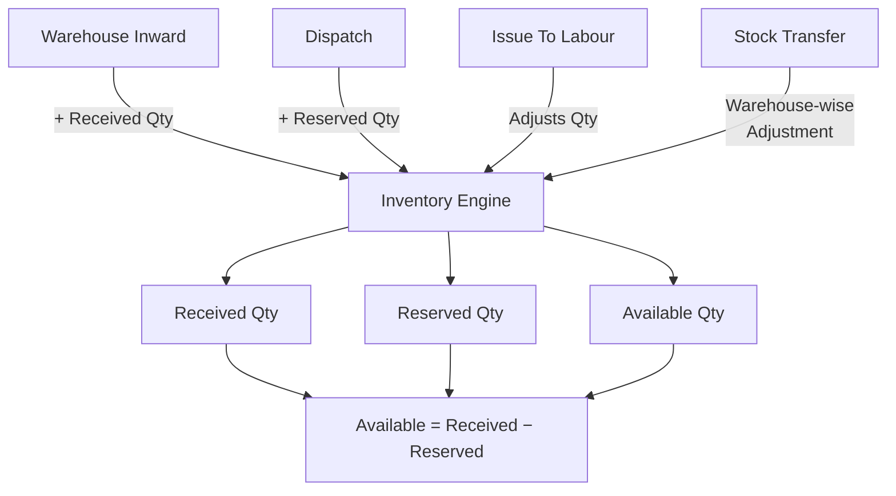

**Inventory updates automatically when:**
- A dispatch occurs
- A warehouse inward is completed
- A labour issue is created or returned
- A stock transfer is processed

---

## 📊 Dashboard Module

Dashboard provides **summary analytics** across all modules at a glance.

**Example widgets:**

| Widget | Description |
|--------|-------------|
| Total Orders | Count and value of all orders |
| Total Dispatches | Count of dispatched items |
| Inventory Stock Overview | Stock levels per item per warehouse |
| Pending Dispatch | Orders awaiting dispatch |
| Pending Inwards | Stock awaiting inward entry |
| Low Stock Items | Items falling below safe threshold |

**Dashboard layout covers:** Orders Summary · Dispatch Summary · Warehouse Activity · Inventory Statistics

---

## 🔄 Complete Project Workflow

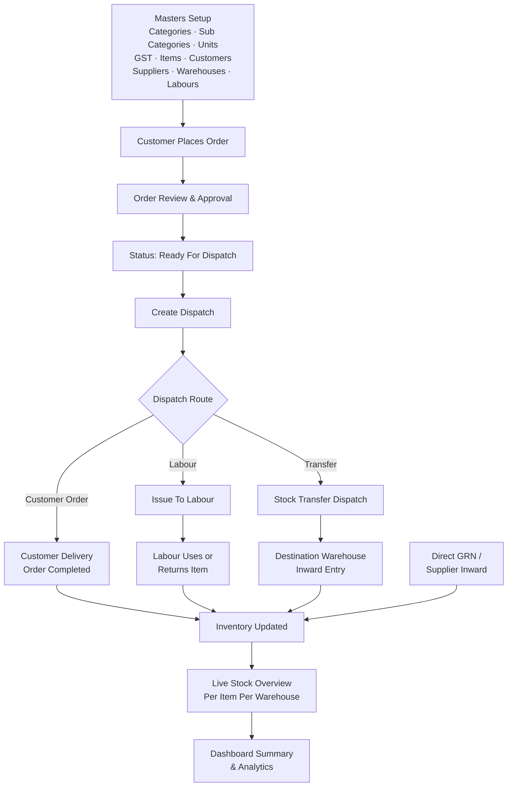

---

## 🔁 Module-Wise Working Flow

### 1. Masters Flow

Masters are created first because **all transaction modules depend on them**.

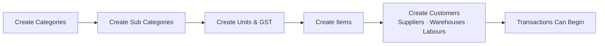

**Sequence:** Create categories → create subcategories → create units → create GST slabs → create items → create customers / suppliers / warehouses / labours. Without this sequence, transaction modules cannot function properly.

---

### 2. Order to Dispatch Flow

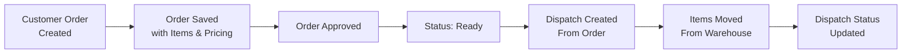

**How it works:**
1. User creates an order with customer and item details
2. Once reviewed, the order is approved and marked ready
3. A dispatch is generated from the order — copying item and customer details
4. Dispatch triggers the stock movement process and updates status

---

### 3. Dispatch to Labour Flow

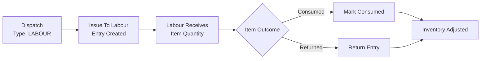

**How it works:**
1. User creates a labour issue from the dispatch screen
2. Labour receives the specified item quantity
3. The item may be fully consumed or partially/fully returned
4. Inventory reflects the actual movement in both cases

---

### 4. Stock Transfer Flow

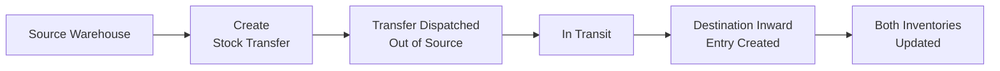

**How it works:**
1. Stock transfer is initiated from the source warehouse
2. Source warehouse dispatches the transfer — reducing its stock
3. Destination warehouse creates an inward entry on receipt
4. Inventory records remain warehouse-specific and both sides are updated

---

### 5. Warehouse Inward Flow

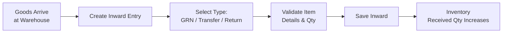

**How it works:**
1. Stock received is recorded in a new inward entry
2. The inward type is selected (GRN, transfer inward, or return)
3. Item quantities are validated before saving
4. Inventory received quantity increases automatically

---

### 6. Inventory Flow

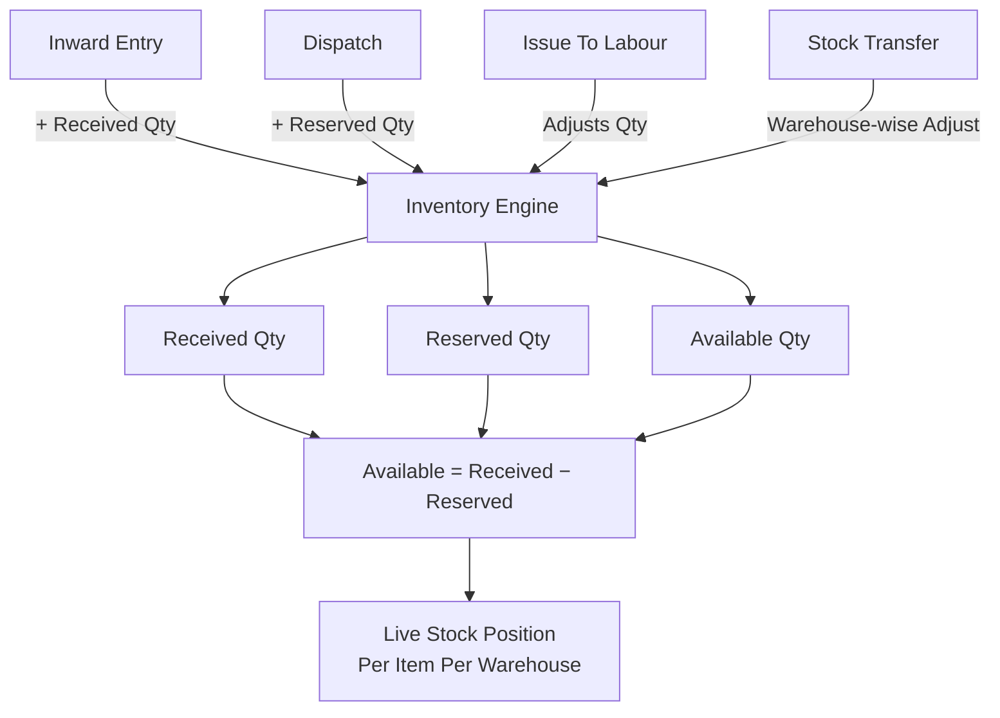

**Notes:**
- **Inward increases stock** — received quantity goes up
- **Dispatch and issue flows reserve stock** — reserved quantity goes up, available goes down
- **Transfer adjusts warehouse-wise** — source decreases, destination increases
- **Inventory is the final stock truth** — all modules feed into it

---

## 🧩 Module → Submodule → Sub-Submodule Structure

### 1. Authentication
- Login · Register · Logout
- Protected Routes · Access Denied

### 2. Dashboard
- Summary Cards · Inventory Snapshot
- Pending Operations · Module Statistics
- Warehouse Overview · Low Stock Indicators

### 3. Masters
All master sub-modules share the same common actions:

| Sub Module | Common Actions |
|------------|---------------|
| Categories | List · Add · Edit · View · Delete |
| Sub Categories | List · Add · Edit · View · Delete |
| Units | List · Add · Edit · View · Delete |
| GST | List · Add · Edit · View · Delete |
| Items | List · Add · Edit · View · Delete |
| Customers | List · Add · Edit · View · Delete |
| Suppliers | List · Add · Edit · View · Delete |
| Warehouses | List · Add · Edit · View · Delete |
| Labours | List · Add · Edit · View · Delete |

### 4. Users & Permissions
- User List · User Create · User Edit
- Password Update
- Role / Permission Assignment
- Module access control · Action-level permission control

### 5. Orders
- Orders List · Order Create · Order Edit · Order View
- Ready To Dispatch stage · Status update flow
- Sub-sections: Customer Details · Item Details · Quantity/Rate · Tax/Totals · Status History

### 6. Warehouse

**Dispatch**
- Ready To Dispatch List
- Dispatch List · Create Dispatch · Edit Dispatch · View Dispatch
- Deliver Dispatch · Revert Dispatch

**Warehouse Inward**
- Inward List · GRN Inward · Pending Transfer Inward
- Inward View · Inward Create · Inward Complete Flow

**Stock Transfer**
- Transfer List · Create Transfer · Dispatch Transfer
- Pending Transfer · Complete Transfer · Revert Transfer

**Issue To Labour**
- Labour Issue List · Create Labour Issue · View Labour Issue · Edit Labour Issue
- Pending Labour Inward / Return Handling

### 7. Inventory
- In Stock List · Item Stock View
- Warehouse Overview · Stock Summary
- Received / Reserved / Available quantity display

---

## 🖥 Frontend Architecture

```
src/
 ├── components/
 │    ├── Table/
 │    ├── Forms/
 │    └── Layout/
 ├── pages/
 │    ├── Authentication/
 │    ├── Dashboard/
 │    ├── Masters/
 │    ├── Orders/
 │    ├── Warehouse/
 │    └── Inventory/
 ├── slices/
 │    ├── auth/
 │    ├── orders/
 │    ├── inventory/
 │    └── warehouse/
 ├── routes/
 ├── utils/
 └── types/
```

---

## ⚙ Backend Architecture

```
backend/
 ├── controllers/
 ├── models/
 ├── routes/
 ├── services/
 ├── middlewares/
 ├── utils/
 └── config/
```

---

## 🗂 Database / Collection Schema Overview

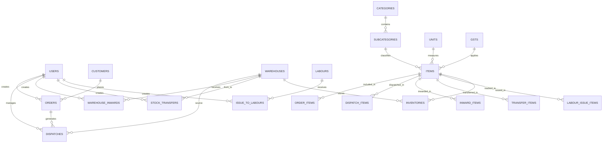

### Data Model Explanation

**1. Users** — Stores login and access information. Used for authentication, role-based access, and tracking `createdBy` / `updatedBy` on all records.

**2. Masters Collections** — Base references used across the entire system:
- **Categories** — Main classification of items
- **SubCategories** — Child classification under categories
- **Units** — Measurement units like Nos, Kg, Box, Meter
- **GSTs** — Tax slabs for items
- **Items** — Core inventory items linked to category, subcategory, unit, and GST
- **Customers** — Used in order and dispatch modules
- **Suppliers** — Used for procurement and future inward processes
- **Warehouses** — Physical storage locations for stock
- **Labours** — Workers to whom material can be issued

**3. Orders** — Stores customer order data including `orderNo`, customer details, items, quantities, pricing, totals, and order status. Orders are the **starting point** for dispatch-based sales flow.

**4. Dispatches** — Stores item movement out of warehouse. Includes `dispatchNo`, `dispatchDate`, `dispatchType`, order linkage, warehouse source, customer details, items, transport/delivery info, and status. Dispatch reduces or reserves stock depending on the workflow.

**5. Warehouse Inwards** — Stores stock received into warehouse. Includes `inwardNo`, `inwardType`, reference document, warehouse details, item list, quantities, date, and remarks. Warehouse inward **increases inventory**.

**6. Stock Transfers** — Moves stock from one warehouse to another. Source stock is moved out, destination warehouse receives inward, and inventory is updated for both ends.

**7. Issue To Labour** — Tracks item issuance to workers. Includes labour name, linked dispatch/reference, warehouse, item list, issued quantity, and consumed/return status. Important for tracing **non-customer stock movement**.

**8. Inventory** — Stores stock summary per item per warehouse. Tracks `receivedQuantity`, `reservedQuantity`, and `availableQuantity`. This module acts as the **live stock position** of the business.

---

## 🔧 Tech Stack

### Frontend

| Technology | Purpose |
|------------|---------|
| React | UI Framework |
| Redux Toolkit | State Management & Async API Thunks |
| TypeScript | Type Safety |
| Bootstrap | Styling & Layout |
| TanStack Table | Advanced Data Tables |
| Formik + Yup | Forms & Validation |
| React Router | Client-Side Routing |

### Backend

| Technology | Purpose |
|------------|---------|
| Node.js | Runtime Environment |
| Express.js | Web Framework |
| MongoDB | Database |
| Mongoose | ODM / Schema Management |
| JWT | Authentication Tokens |

### Tools

| Tool | Use |
|------|-----|
| Postman | API Testing |
| Git + GitHub | Version Control |
| VS Code | Development IDE |

---

## 🔐 Authentication

Authentication uses **JWT tokens** for stateless, secure request validation.

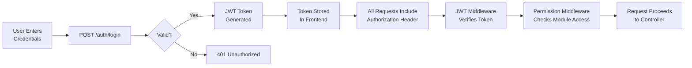

---

## 🚀 Installation

### 1. Clone Repository

```bash
git clone https://github.com/yourusername/warehouse-management-system.git
cd warehouse-management-system
```

### 2. Backend Setup

```bash
cd backend
npm install
npm run dev
```

### 3. Frontend Setup

```bash
cd frontend
npm install
npm run dev
```

---

## 🌱 Future Improvements

- [ ] Barcode scanning integration
- [ ] PDF invoice generation
- [ ] Advanced analytics dashboard
- [ ] Email notifications
- [ ] Mobile responsive UI
- [ ] Multi-warehouse analytics

---

## 🌟 Why This Project Is Strong

This project is **not just CRUD**. It demonstrates:

- **Modular full-stack architecture** — clean separation of concerns across all layers
- **Real business process handling** — mirrors actual warehouse and stock operations end-to-end
- **Warehouse and stock movement logic** — inward, dispatch, transfer, and labour flows all interconnected
- **Interconnected module dependencies** — modules work together, not in isolation
- **Role-based permissions** — enterprise-grade access control per module and action
- **Reusable table and form structure** — shared components used consistently throughout
- **Real inventory calculations** — formula-driven, auto-updating stock tracking
- **Scalable enterprise-style design** — architecture built to extend into full ERP systems

This makes it a strong portfolio project for:

- Full Stack Developer roles
- MERN Stack Developer roles
- ERP / Inventory software projects
- Warehouse / Operations tech solutions

---

<p align="center">Built with ❤️ using the MERN Stack</p>
